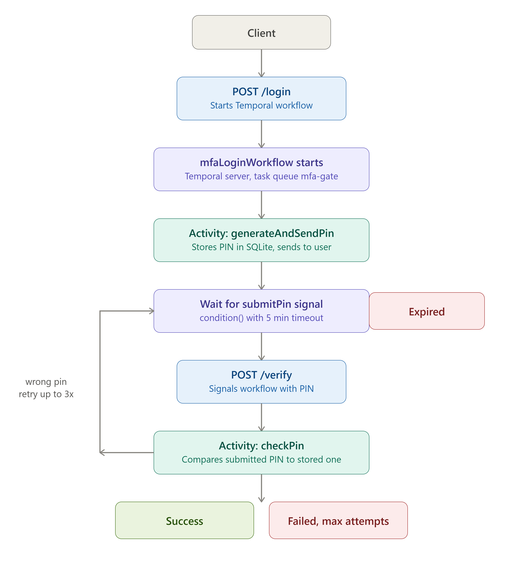

# Interactive MFA Timed Gate

> Bootcamp 2026 Project — A realistic multi-factor authentication (MFA) system exploring how time-bound verification codes work under the hood, and where naive implementations break.

## 🚀 Overview

This project implements two independent MFA mechanisms on top of a Node.js + Express + SQLite backend:

- **SMS-style PIN verification** — server-generated 6-digit code, 5-minute expiry, simulated delivery
- **TOTP / QR-based authentication (bonus)** — the same mechanism as Google Authenticator; no per-login delivery or storage needed

Building both side by side is the point: it makes the structural difference between "deliver-and-store" and "independently-compute" authentication immediately obvious.

## ⚙️ Features

✅ 6-digit PIN generation with 5-minute expiry

✅ Retry limit (max 3 attempts), then permanent lockout

✅ SQLite persistence (WAL mode) — survives server restarts

✅ Check-on-read + background cleanup sweep for expired PINs

✅ TOTP secret registration + QR code generation

✅ Time-based, stateless TOTP verification

✅ 27 automated tests (unit + HTTP-level)

✅ GitHub Actions CI on every push/PR


## 🔄 Authentication Flows

**PIN flow (stateful):**
`/login` → server generates PIN → "delivers" it (console/log) → stores it with expiry → user submits via `/verify` → server checks and deletes the row

**TOTP flow (stateless at login time):**
Register once → server generates a secret + QR code → user scans with an authenticator app → at login, user submits the app's current code via `/verify` → server independently recomputes and compares — no delivery, no per-login storage

## 🧪 API Endpoints

| Endpoint | Method | Description |
|---|---|---|
| `/login` | POST | Start a PIN login attempt |
| `/verify` | POST | Verify a PIN (`{loginId, pin}`) or TOTP code (`{userId, totp}`) |
| `/health` | GET | Health check |

## 🛠 Setup

```bash
git clone https://github.com/LaibaBatoool/bootcamp-2026-mfa-gate.git
cd bootcamp-2026-mfa-gate
npm install
npm start
```

No API keys or external services needed — delivery is simulated locally.

## ▶️ Trying it out

**PIN flow:**
```bash
curl -X POST http://localhost:3000/login -H "Content-Type: application/json" -d '{"userId": 1}'
curl -X POST http://localhost:3000/verify -H "Content-Type: application/json" -d '{"loginId": 1, "pin": "123456"}'
```

**TOTP flow** (see `docs/manual-testing-commands.md` for generating a test code):
```bash
curl -X POST http://localhost:3000/verify -H "Content-Type: application/json" -d '{"userId": 1, "totp": "123456"}'
```

> **Windows PowerShell users:** `curl` is aliased to `Invoke-WebRequest`, which won't accept these flags. Use `Invoke-RestMethod` instead — see `docs/manual-testing-commands.md`.

## 🧪 Running tests

```bash
npm test
```

Runs all 27 tests (PIN service, TOTP service, HTTP routes) against an isolated in-memory database — your local `mfa.db` is never touched.

## 🧠 Key design decisions

| Decision | Why |
|---|---|
| SQLite over in-memory/Redis | Survives restarts (needed to demonstrate the failure mode); zero external setup vs. Redis |
| WAL journal mode | More resilient to a process being killed mid-write |
| Mocked delivery, not Twilio | Keeps the project runnable by anyone, avoids committing real credentials, isolates the actual lesson from an unrelated integration |
| Cleanup: check-on-read + 60s sweep | Catches both verified-late and fully-abandoned attempts |
| One-time-use PINs | A successful verify deletes the row — no replay within the expiry window |
| 3-attempt lockout | Prevents unlimited guessing |

## ⚠️ Failure mode: server restart mid-login

A pending PIN row was deliberately left unverified, then the server was killed and restarted. The row survived intact — proving SQLite persistence prevents the *silent total data loss* that an in-memory store would suffer, even though the row is now "orphaned" until the background sweep or expiry resolves it.

Full writeup + screenshots: [`docs/failure-mode-demo.md`](docs/failure-mode-demo.md)

## ⏱ Temporal Workflow Integration

To explore durable execution as an alternative to the raw SQLite approach above, the PIN flow was re-implemented on top of [Temporal](https://temporal.io/) — a workflow orchestration engine that keeps state alive across crashes and restarts without you managing that persistence by hand.

### Why Temporal
The original PIN flow relies on manually persisting and cleaning up state (SQLite rows, expiry sweeps, retry counters). Temporal handles all of that inside a durable workflow: if the worker process crashes mid-verification, the workflow simply resumes from where it left off — no orphaned rows, no manual sweep needed.

### How it works
1. `/login` starts a Temporal workflow and returns a `workflowId` in the response
2. The 6-digit PIN is generated inside the workflow and logged to the terminal (simulated delivery, same as the original flow)
3. The frontend uses the `workflowId` to check verification status
4. On submit, the UI reflects the workflow's outcome — `false` for a failed/incorrect PIN, `true` for a successful verification



### Running it locally
Requires the [Temporal CLI](https://docs.temporal.io/cli) installed. Then, across three terminals:

```bash
# Terminal 1 — start the local Temporal server
cd bootcamp-2026-mfa-gate
temporal server start-dev

# Terminal 2 — start the workflow worker
node src/temporal/worker.js

# Terminal 3 — start the app
npm start
```

Full command reference: `docs/temporal-workflow-commands.md`

### Demo
| Login triggers workflow | Workflow created in Temporal | Verification result |
|---|---|---|
|  |  |  |

## 📋 Assumptions

- `loginId` is a raw database id for simplicity; production would use a signed token instead
- No signup/registration endpoint — users are seeded as mock fixtures
- TOTP secrets are stored in plaintext locally; production would encrypt at rest
- No real SMS/email delivery, retries, or delivery-failure handling — explicitly out of scope

## 🤖 AI code review

Reviewed using CodeRabbit prior to human review — see the Pull Request description for scope and findings.

## 📁 Project structure

```
src/
  db.js, users.js, notifier.js       Data layer + mock delivery
  pinService.js, totpService.js      Core MFA logic
  routes/login.js, routes/verify.js  Express routes
  server.js                         App entry point
  temporal/                         Temporal workflow, activities, and worker
tests/                              Jest unit + HTTP-level tests
docs/                               Failure-mode demo, testing commands
screenshots/                        Demo evidence
.github/workflows/ci.yml            CI workflow
```
